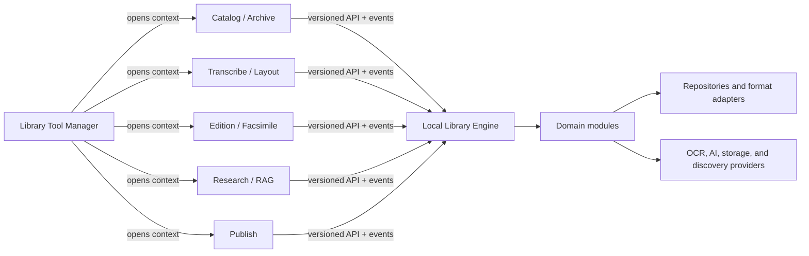

# Modular engine, workbenches, and generalization plan

Status: **accepted direction; incremental implementation underway**
(updated 2026-07-19). The target workbench split is not complete, but the
engine/client boundary described here now has several production verticals.

## Implementation baseline (2026-07-19)

Replica, catalogue query/command, translation, jobs, capabilities, and
existing-item interchange now cross engine boundaries in production. The
larger workbench and packaging split described below remains the target:

- `tools/replica_service.py` is framework-neutral and owns content revisions,
  protected-page policy, proposal envelopes/apply policy, deterministic legacy
  export identity, and automatic recurring-layout family proposals.
- Region reads return revisions; writes require conditional replacement and
  return the canonical saved record. Stable region IDs are created before
  editing, duplicate identities are rejected, and page extension data survives
  the round trip.
- OCR/layout automation preserves human, imported, and verified work. New
  output becomes a separately revisioned proposal that can be applied or
  dismissed explicitly; interrupted derived-text rebuilds remain marked as
  pending rather than becoming silent drift.
- Replica exports are immutable snapshots and no longer mint IDs or book state
  during a GET. JSON, compiled text, binary assets, and standalone `.lib`
  sealing use atomic replacement that preserves the previous artifact on
  failure.
- Translation provenance now records a paragraph-sensitive SHA-256 source
  revision and source layer/model per page, while legacy SHA-1 metadata remains
  readable. Imported or legacy translations remain visibly untracked instead
  of inheriting false provenance.
- The current browser workbench uses page revisions, stable IDs, load-failure
  locks, race-safe saves, and separate async context generations. This makes it
  safer to replace, but it is still the transitional client—not the proposed
  manager plus independent workbench architecture.
- `src/librarytool` is now an installable, framework-neutral package with
  structured commands/results/errors, item and repository ports, explicit
  Replica, interchange, translation, and item-command units of work, text-
  layer services, and callback-configured filesystem adapters. It imports
  neither Flask nor the transitional `tools` modules.
- Region CRUD, proposal review, layout-family proposals, and region
  recompilation run through `ReplicaApplicationService`. Flask retains the
  existing URLs as a compatibility transport and maps structured engine
  failures to HTTP responses.
- `engine-client.js` is the browser's single transport boundary. The Replica
  controller has no direct `fetch()` calls or `/api/` route knowledge; it
  retains only navigation generations, drafts, cache invalidation, and DOM
  behavior.
- `JobManager` is now the framework-neutral lifecycle boundary for OCR,
  analysis, Smart Scan, and publishing work. It owns safe persisted history,
  bounded retention, cooperative cancellation, restart interruption, typed
  subjects/progress/outputs, monotonic revisions, and a cursor event contract.
  Existing worker dictionaries and routes remain compatibility adapters while
  `/api/v1/jobs` and `EngineClient.jobs` expose the new client contract.
- A module/capability registry resolves required and optional dependencies and
  reports available, degraded, or blocked modules/workbenches through
  `/api/v1/capabilities`. This is the first executable foundation for a future
  launcher hiding tools whose required components are absent. Modules are
  independently composable in a validated, immutable service registry today.
  Module-owned item readiness and command policies follow the same resolution:
  a blocked owner or missing required capability withholds its policies as well
  as its services and workbenches. Modules are still shipped together;
  separately installable packages and signed bundles remain a packaging
  milestone, not a current product claim.
- The catalogue spine now has framework-neutral, immutable item,
  representation, artifact, and workbench-state queries. Item responses carry
  separate record and aggregate revisions, derive artifact freshness from
  source provenance, and accept independently installed readiness/command
  policies. Replica, translation, research, publishing, and text-layer
  eligibility are therefore contributed by modules rather than hardcoded into
  the item model.
- Flask now composes that catalogue spine over the current build and entry-
  folder stores. Versioned list/detail, representation, artifact, and
  readiness resources provide structured errors and aggregate ETags;
  `EngineClient.items` is their browser boundary. The old workbench's initial
  build load uses an explicit compatibility projection, while default item
  DTOs expose opaque representation resource identities instead of attached
  filesystem paths.
- Catalogue-only create and update now also cross the engine. Immutable
  `ItemDraft`, `ItemPatch`, command, snapshot, and receipt contracts are backed
  by a recoverable filesystem repository with durable replay receipts,
  cross-process serialization, allocation checks, tombstone support, rollback,
  and restart recovery. Production `POST /api/v1/items` and
  `PATCH /api/v1/items/{id}` require a portable `Idempotency-Key`; update also
  requires strong record-level `If-Record-Match`. `EngineClient.items` owns
  the same contract. Those routes intentionally accept catalogue metadata
  only. Representation attachment is now a distinct optional engine service:
  attach, replace, and detach use dual item/representation preconditions,
  replay-safe operation IDs, safe receipts, and one recoverable transaction
  that publishes the catalogue last. Versioned HTTP resources and
  `EngineClient.items` expose that boundary, and the browser's interactive
  primary/secondary PDF controls now use it instead of HEAD plus generic build
  PATCH. Browser item creation also uses the durable engine command and retains
  one idempotency key across ambiguous responses. Its three transitional local
  acquisition fields are seeded afterward through a narrow conditional bridge;
  that bridge preserves concurrent catalogue edits and never becomes the
  allocation authority. The current production adapter supports referenced
  local PDFs; the neutral contract also carries copied acquisition, expected
  SHA-256, and expected size, but owned-asset materialization is still a later
  assets boundary. Legacy create, PATCH, and direct undo-restore reject
  representation fields. Entry-folder repointing and page rewrites refresh
  their integrity manifest through the same command service. Item
  delete/restore now has a framework-neutral composite lifecycle contract and
  a recoverable managed-tree move primitive. The production module, versioned
  resources, `EngineClient` delete/restore flow, browser history, retained job
  guard, cloud-sync policy, and compatibility adapters now use that one
  authority. Engine-native and transitional synchronous writers revalidate
  live item membership while holding the shared workspace lease, so they
  cannot recreate a managed tree after deletion. Active tombstones reserve
  their item identities, including case aliases, for direct create and new-item
  `.lib` open. That reservation survives temporarily disabling the lifecycle
  command module so preserved module state cannot be overwritten. Historical
  catalogue-only Trash records are download-only. The catalogue metadata
  editor's create and normal edit/save paths are engine-backed. Attention,
  category, and release-bundle edits use the same conditional receipt chain;
  raw build PATCH is restricted to transitional OCR/workflow selectors, and
  the initial item read no longer persists inferred grouping.
- The generic item command service now accepts a validation-only product
  profile. Replay is checked before the profile; create validates before ID
  allocation and update validates the complete immutable candidate before
  staging. The production WHL book profile is Flask-free and receives its
  category vocabulary through an injected port. The legacy WHL catalogue-row
  revision, raw validation, decode/encode, managed-field preservation, and
  restore logic have also moved from `server.py` into a reusable filesystem
  codec with injected clock, taxonomy, and representation-manifest seams.
- The revisioned translation aggregate is now composed over the legacy entry
  folders through `FilesystemTranslationRepository`. Versioned list/detail
  resources and conditional page replacement expose authoritative current,
  stale, untracked, missing, and orphaned selector status. A replacement must
  match both the translation document and its resolved OCR source snapshot;
  text, per-page provenance, and artifact provenance publish through one
  recoverable write set. `EngineClient.translations` is the browser boundary,
  and the current Replica preview reads aggregate summaries and stable page
  selectors instead of parsing translation files itself. Provider-backed
  generation remains on the legacy path and is not advertised as an engine
  generation capability.
- A separate revisioned text-layer aggregate contract now exists for the
  durable replacement of the page-marked OCR compatibility helper. It defines
  opaque ordered selectors, exact representation-source pins, document and
  unit revisions, source freshness, conditional single/batch corrections,
  provenance, deterministic content identity, bounded metadata and command
  inputs, and durable replay. Public receipts are deliberately separate from
  the immutable storage-only replay envelope, so command fingerprints cannot
  escape through generic dataclass serialization. A strict native filesystem
  repository now stores closed/versioned documents per item and global hashed
  replay envelopes in one recoverable document-plus-receipt transaction. It
  re-derives every persisted revision, rechecks item/source state at commit,
  rejects redirecting or unstable storage, and performs no lazy query writes.
  The optional first-party `library.text-layers` module now composes the
  aggregate behind a distinct registry service and contributes read/edit
  capabilities only when explicitly bound. It remains off in the production
  host. An opt-in Flask adapter plus `EngineClient.textLayers` now exposes
  versioned list, detail, fixed-range unit pages, and single-unit replacement,
  resolving only that registry service. Unit pages require exact document and
  source pins, use explicit one-based page/limit ranges over canonical order,
  and bind that range, source freshness, and complete units into a strong page
  revision. Pages are limited to 256 units and 8 MiB of canonical unit data;
  the transport enforces its exact envelope ceiling, returns `413` rather than
  truncating an oversized unit/page, and supports strong ETag revalidation.
  Reads are side-effect free and strongly revalidatable; writes require exact
  idempotency, unit/source CAS, and complete provenance. A 1 MiB mutation cap
  and exact 16 MiB coherent-detail cap likewise fail with structured `413`
  responses rather than truncating or publishing. Migration from legacy
  `ocr/*.txt` and production activation still remain before existing
  workbenches may depend on the native aggregate.
- The secret-store contract, current-user DPAPI repository, and optional
  first-party `library.secrets` composition now form a complete but unbound
  backend slice. Only the public masked-status/CAS service enters the registry;
  the repository and provider credential lease remain private. No production
  activation, plaintext migration, or renderer mutation route is implied.
- Electron now authenticates its loopback sidecar with a 256-bit per-launch
  capability retained only by the main process and the sidecar digest. Exact
  Host and supplied-Origin checks, request-provenance and redirect-chain
  tainting, authenticated-response `no-store`, sandbox/navigation/permission
  policy, strict resource-window grants, bounded PDF streaming, and retirement
  of the same-origin remote HTML proxy establish the transport prerequisite for
  secret migration. The compatibility `/api/secrets` route still exposes
  plaintext to the trusted main renderer, so the secret cutover remains open.
- `.lib` import now has immutable command, plan, receipt, planner, repository,
  and unit-of-work contracts. The application service binds idempotency to the
  complete command and rejects malformed plugin plans before staging. A
  filesystem write-set primitive provides private before/after journals,
  cross-process locking, all-file publication or rollback, restart recovery,
  path/junction containment, and terminal receipt retention. Existing-item
  Replica imports now use this boundary: the archive is completely validated
  before staging, and layout, compiled text, figures, styles, translations,
  provenance, and the durable receipt publish as one recoverable transaction.
  New-item open is now a separate, capability-gated composite service. One
  operation allocates and encodes the catalogue row, plans against a pristine
  primary-source destination, stages the complete entry tree plus normal item
  and import receipts, publishes a global replay receipt, and publishes the
  catalogue last through one recoverable write set. The desktop's local-path
  `/api/lib/open` route is only a compatibility adapter; framework-neutral
  clients use the idempotent upload resource at `/api/v1/lib-opens`.
- A provider-neutral Knowledge kernel now models revisioned text corpora,
  stable selectors, lossless deterministic passages, canonical curation
  overlays, lexical evidence retrieval, and revision-pinned evaluation. Its
  historical-text normalizer is versioned against the Unicode database, and
  retrieval returns verbatim source-addressable evidence. Persistence,
  versioned routes, cloud indexes, embeddings, and answer generation remain
  deliberately outside this first local foundation.
- Source execution, editable package installation, tests, and the PyInstaller
  sidecar now all include `src/`, so this boundary is part of the shipped
  runtime rather than a test-only package.
- `LibraryEngine` is now built from versioned `ServiceKey` bindings and sealed
  module contributions. The reusable filesystem composition root selects and
  validates the production query, command, Replica, text-layer, translation,
  interchange, provenance, and job services without Flask imports or hidden
  global path discovery. It rejects unfinished recovery state, unsafe or
  overlapping storage paths, redirecting entry trees, incomplete bindings,
  and item identities that another service in the graph could not address.
  `composition.host.open_filesystem_engine` now supplies the reusable lifecycle
  above that root: it takes immutable configuration and borrowed bindings,
  acquires a non-blocking process-lifetime workspace lease, recovers one owned
  write set under the transitional storage locks, composes the sealed graph,
  rehydrates one owned job manager, and returns an explicitly closable session.
  It has native strict/atomic job-history JSON I/O and imports neither Flask nor
  `tools`. Importing production `server.py` does not claim a workspace. Its
  executable startup opens the host after legacy callbacks are defined and
  before migrations or background threads; an embedded Flask host opens it at
  the first trusted request. Compatibility globals are aliases of the
  session-owned objects, not a second resource graph.

The automatic family detector is deliberately a proposal query. It clusters
geometry and semantic roles, identifies medoid exemplars, separates recurring
recto/verso layouts, reports confidence and exceptions, and does not modify the
book. Region detection providers and a future UI review queue can consume this
same contract without owning the grouping algorithm.

Replica region detection is the first real consumer of that job contract, but
the vertical is only partially extracted. The engine owns stable job identity,
history, cancellation state, events, and protected-work proposal semantics.
The compatibility Flask handler still loads the build and settings, resolves
the local source and provider credentials, and launches the OCR/layout
provider. Alternate clients therefore cannot yet submit provider-neutral
detection through the engine alone. The workbench does observe the shared job
directly and distinguishes completion, failure, cancellation, and restart
interruption instead of inferring completion from browser-local OCR markers.
The item query service is composed into `/api/v1`; existing-item import and
new-item `.lib` open demonstrate recoverable multi-artifact transactions. The
local-path compatibility route is preserved, while `EngineClient` imports or
opens packages through stable idempotent resources and receives complete
durable receipts. Translation reads and human page edits, catalogue-only item
create/update, and representation attachment now demonstrate the same
separation for additional workbench domains. Provider-backed region and
translation generation remain compatibility paths.

### Representation attachment boundary

The source-attachment slice establishes a frontend-independent command model:

- `source_token` is an adapter-only acquisition input. It is absent from query
  DTOs, public mutation receipts, logs, and opaque representation locators. The
  durable command fingerprint remains private because it binds that token.
- Attach requires item CAS and absence of the representation; replace and
  detach require both the item and representation revisions. A durable receipt
  records exact before/after snapshots and is published before the catalogue in
  the same recoverable write set.
- The browser retains an operation ID across ambiguous transport failures,
  treats a valid receipt as committed even if refresh fails, and chains undo and
  redo from the receipt's exact revisions. A concurrent change therefore
  conflicts instead of being silently overwritten.
- The production reference adapter structurally parses and hashes a PDF from
  one stable handle, verifies the path still resolves to that same identity,
  and stores its digest, size, and stat fingerprint. Queries expose
  `content_state`: `unchanged`, `drifted`, `missing`, or `untracked`. A drifted
  or missing source is unavailable until explicit replacement succeeds.
- `unchanged` means the recorded identity/stat fingerprint has not changed
  since the attachment hash was taken; it is not a fresh whole-file hash on
  every query. Managed immutable copies and an explicit deep-verify command are
  later asset-service work.
- Transitional `build-workbench` projections still contain paths because the
  current browser has path-based PDF consumers. They are explicit and
  `Cache-Control: no-store`; portable clients consume the default opaque DTOs.

Legacy create, PATCH, and arbitrary JSON restore cannot write representation
fields. Folder repointing and page delete/restore refresh the manifest through
the command boundary after their file operation. Those file rewrites are not
yet part of the same asset transaction; a crash between the byte rewrite and
manifest refresh is surfaced as `drifted` rather than accepted as current.
The existing Trash workflow remains a trusted, server-owned lifecycle adapter:
it cannot inject caller-supplied source state, and a restored reference whose
file changed while deleted returns as drifted and unavailable. Browser history
restores deleted catalogue records through that server-owned tombstone instead
of reconstructing sources from client JSON; an exact response-lost restore is
replayable, while an intervening edit conflicts. Atomic item, managed-tree,
tombstone, and receipt publication belongs to the item lifecycle boundary
described below.

The neutral contract admits `copy`, expected digest, and expected size, but the
production adapter intentionally installs reference-only PDF acquisition until
owned asset staging and provider traits are available.

### Canvas identity foundation

Canvas identity is the next shared dependency, ahead of provider-backed region
or translation commands. Today Replica raster requests, region keys,
translation selectors, Knowledge inputs, remarks, `.lib` pages, and several job
subjects still identify content by a local PDF path plus a mutable page number.
Extracting more automation on top of that would freeze a contract that every
future Qt, Godot, web, and batch client would later have to break.

The engine now defines a read-only canvas query boundary:

- `CanvasKey(item_id, representation_id, canvas_id)` uses an opaque persisted
  canvas identity. Order, label, filename, PDF ordinal, and path are never
  identity.
- `CanvasExtent` supports a spatial width/height/unit, temporal duration, or
  both, so the same model can address pages, photographs, maps, audio, and
  video without pretending all media are PDF pages.
- `CanvasView` has its own revision, explicit order, presentation label,
  availability, supported resource kinds, public metadata, and extent.
- `CanvasSequenceView` binds the ordered set to an exact representation
  revision and has a separate deterministic sequence revision.
- `CanvasQueryService` lists or gets only already-persisted IDs. It never mints
  identity during a GET, and its public serialization excludes adapter paths,
  filenames, URIs, asset references, ordinals, and storage positions.

The service keys and an optional first-party `library.canvases` module now
exist, but the production WHL host does not bind or advertise them. A strict,
read-only filesystem adapter consumes a private
`.librarytool/canvases.json` index beneath each managed item tree. It binds a
requested sequence to the exact live representation revision, rejects unsafe
or ambiguous storage, validates but strips private source positions and paths,
and isolates an optional representation's drift from healthy sequences. It
does not create, repair, or infer IDs on read. The engine now also defines the
explicit idempotent preparation command: exact replay precedes media reads,
the repository owns inspection and private source correlations, and a
monotonic active/retired ledger prevents removed canvas IDs from ever being
recycled. Its receipt exposes only the exact representation revision and
ordered active IDs. The recoverable filesystem command adapter now publishes
the query index, private ledger, and receipt in one transaction, and reusable
composition installs query and preparation only as an invariant pair.

The private page-key materialization foundation is now implemented as a closed,
versioned fourth preparation artifact. Inspection supplies an exact asset
digest plus ordered observations and private matching evidence, never an
identity. The repository mints random 256-bit correlations, records current
private locators and active/retired generation state, and stages the
materialization, identity ledger, public index, and receipt in one recoverable
transaction. Identical asset bytes reuse stored correlations, including across
a new representation revision. A digest change at the same revision is source
drift; a digest change with a new revision requires explicit reconciliation.
Neither path allocates IDs or mutates artifacts, and a legacy index/ledger pair
without materialization refuses implicit migration.

An exact attached-PDF inspector now closes the next adapter seam. An injected
attachment authority must identify one item, representation revision, size,
and SHA-256; the adapter copies and hashes that source once, parses only the
immutable private snapshot, and produces path-free ordered observations. It
handles bounded PDF numeric geometry and `/UserUnit`, uses a fixed pypdf-6
snapshot-geometry evidence profile, and fails before allocation or publication
on drift. The evidence is intentionally snapshot-specific, not a page-content
fingerprint suitable for automatic reconciliation. Stable external path aliases
are permitted because exact bytes are pinned; this does not claim containment
of referenced files.

`CanvasBindings.for_attached_pdfs(...)` makes that inspector explicitly
composable, but it is not a hidden production default. In-process pypdf parsing
has byte, declared-count, and post-materialization page limits, yet is not a
hostile-input CPU/memory sandbox. Broad ingestion should therefore put parsing
in a killable worker with time and memory limits before advertising the binding
as hardened. Remaining production work is the attachment-authority/host
binding, that worker boundary, versioned HTTP/client resources, and a separate
reconciliation command whose evidence may propose but never silently choose
mappings. Ordinals and paths are recyclable; PDF object IDs change on rewrite;
content/raster hashes collide for duplicate pages and remain evidence rather
than identity. After that, migrate raster delivery and the Replica filmstrip
first, followed by region/text/translation selectors, remarks, jobs, and
`.lib` compatibility.
Page deletion/restore ultimately becomes one recoverable transaction across
the source asset, page manifest, canvas sequence, text/layout selectors,
provenance, and catalogue revision while preserving surviving canvas IDs.

### Item lifecycle foundation

Recoverable delete/restore is now modeled independently from any UI or Flask
route. Delete requires both the catalogue record revision and the logical
managed-tree revision. Restore requires the tombstone revision and refuses a
recreated record or orphan tree. Exact operation retries replay a durable
receipt; reuse of the operation ID for different preconditions conflicts. The
public tombstone contains identities and revisions only. The filesystem
adapter keeps the full raw record and storage details in a separate private,
versioned namespace, preserving unknown/storage-only fields across restore.

The shared write set can now relocate a whole managed entry tree without
copying its bytes. A version-2 journal fingerprints paths, empty directories,
file bytes, and modes; rejects links, special files, overlap, collisions, and
cross-device moves; and uses atomic no-replace renames on supported desktop
platforms. Tree moves publish before staged file records, letting a lifecycle
repository persist tombstone and receipt state before publishing the catalogue
last. Rollback and restart recovery reverse that order. Version-1 file-only
journals retain their original semantics, while older binaries reject the new
version instead of silently ignoring a moved tree.

`ManagedTreeSnapshot` describes the logical set of engine-owned assets, not an
external referenced PDF. A live item with no entry directory receives a stable
empty-tree revision and uses a no-op move; an orphan physical directory still
counts as a restore collision. The production filesystem repository and its
optional service-registry/composition wiring are now enabled. A coherent
preflight query supplies both CAS tokens, and `JobManager` supplies a retained
all-kind deletion guard. Versioned resources expose delete plus durable
tombstone list/detail/restore; the browser uses them for exact delete, undo,
and redo. In-process cloud catalogue and entry sync apply the lifecycle
deletion index, and standalone mutating sync is refused because it cannot join
the host-owned guard. Compatibility delete/restore routes delegate to the same
service. Engine Replica transactions and all identified synchronous legacy
entry writers revalidate membership inside the shared workspace lease; legacy
page and translation Trash payloads cannot resurrect a deleted aggregate.

The guarantee is deliberately scoped to one authoritative local workspace.
Lifecycle tombstones are not yet replicated through the ordinary cloud build
mirror, so a fresh independent host can still observe older cloud rows and
entry objects. Multi-host editing requires a dedicated replicated lifecycle
event/tombstone protocol; last-write-wins catalogue rows are not an acceptable
substitute. Until that exists, Qt, Godot, CLI, and web workbenches either
connect to the sole sidecar or become the sole conforming workspace owner.

### Translation aggregate boundary

The scoped first provider-neutral translation vertical is in production. It
lists translations, reads one coherent translation with authoritative status,
and conditionally replaces one page. The engine, not its caller, resolves the OCR
source layer and canvas text. The filesystem adapter retains compatible legacy
documents and provenance while supplying stable aggregate identities,
recoverable writes, strict storage validation, and one status definition
across clients. Current, stale, untracked, missing, and orphaned selectors are
derived from the source snapshot and are never accepted from a request.

Provider-backed generation is deliberately still separate and unfinished.
The current generator selects source text, invokes a provider, mutates page-
marked text, updates provenance, and publishes job state through legacy Flask
logic. Moving only that provider call would make alternate clients reproduce
source-selection policy and retain races between source edits, human edits,
metadata, and generation. Its eventual engine job must pin the document and
source revisions, fingerprint the complete recipe, preserve reviewed or
untracked human work, avoid silent source truncation, and commit completed
pages through the aggregate command. Capability discovery should advertise
reading/editing independently and expose generation only for an installed,
configured, healthy provider.

### Revision and precondition semantics

ETags and mutation preconditions name different scopes and must not be treated
as interchangeable:

- Collection, item, representation, artifact, readiness, and translation
  responses use strong **aggregate ETags** for HTTP cache revalidation. The
  value identifies the exact returned view, so it can change when a derived
  status, projection, source layer, or child artifact changes even if the
  catalogue record did not.
- Item detail exposes its narrower canonical `record_revision` in the body and
  as `X-Record-Revision`. Catalogue update uses that value in one strong
  `If-Record-Match` header. Create and update also require
  `Idempotency-Key`, whose replay identity is bound to the complete command.
  An aggregate item ETag must never be sent as the record precondition.
- Translation detail has a view ETag plus explicit `X-Document-Revision` and
  `X-Source-Revision` headers. Page replacement requires both named resources:
  strong `If-Document-Match` for the translation document and strong
  `If-Source-Match` for the source snapshot. This prevents an edit based on
  either stale translation text or stale OCR from silently winning.

Named subresource validators are part of the semantic client contract, not a
Flask convention. A future local IPC, Qt, Godot, or CLI transport must preserve
the same scopes even if it does not use HTTP header syntax.

### Production composition and ranked next boundaries

The reusable, Flask-free filesystem graph composer now accepts explicit paths,
shared resources, compatibility callbacks, provider ports, and installed
module contributions and returns one validated `LibraryEngine`. Production
Flask and headless tests receive that object without putting transport behavior
in composition. Composition deliberately does not recover storage, create
global resources, start workers, or own shutdown; it verifies that its host has
settled recovery before exposing services.

The graph also accepts an optional complete `CanvasBindings` bundle. It binds
authoritative item/representation snapshots, local inspection, monotonic ID
allocation, and one broad host lock, or withholds both canvas services. The
first-party capability graph therefore supports a catalogue-only installation
without dead controls and upgrades the Facsimile workbench only when both
canvas read and prepare are real. The explicit attached-PDF factory now supplies
the inspection half from a caller-owned exact-asset authority. Production still
supplies no bundle until that authority, hostile-parser isolation, transport,
and reconciliation policies are installed.

The same composition root now accepts an optional complete
`ProviderDiscoveryBindings` bundle. Its immutable registry describes stable
provider IDs and semantic versions, exact capability contract revisions,
local/remote and offline/network execution, batch/streaming support, media and
language ranges, declared limits, and required secret-*status* IDs using the
secret store's canonical colon-delimited namespace grammar. It carries
no SDK objects, provider configuration, paths, or credential values. Hosts
inject cached, side-effect-free health and secret-presence snapshots; neither
composition nor discovery contacts a provider. Selection is explicit: a user
choice takes precedence over a declared default, and an unhealthy user choice
never silently falls back. Missing selection, provider, capability,
configuration, health, or secret status fails the corresponding command
closed with one fixed public reason.

When that bundle is present, the optional `library.providers` module exposes
read-only `library.providers.discover` and `/api/v1/providers`; the strict
browser client rejects unknown fields, inconsistent availability, private
command fingerprints, secret values, and noncanonical failure text. Production
does not yet bind the bundle. Consequently the route reports the optional
service as unavailable, capability discovery advertises no provider-discovery
module, and no legacy Replica, OCR, translation, image, embedding, or answer
generator is represented as a production engine command. This is a truthful
extension seam, not an adapter over the old UI-owned generation paths.

The transport-neutral lifecycle host above it is now implemented. Importing or
constructing its configuration performs no I/O. Opening a session creates the
workspace resources, rejects concurrent conforming hosts on the same root,
recovers interrupted writes before composition, rehydrates jobs only after a
valid graph exists, and exposes recovery diagnostics. Closing is explicit,
thread-safe, and idempotent. A Python CLI or Qt process can own the session
directly; a Godot workbench can use the same host in a local sidecar. No host
starts implicit workers. Engine, job-manager, provenance, and write-set objects
obtained from a session are borrowed for that session lifetime and must not be
used after close; Python references cannot themselves be revoked.

This is not yet a claim of coordinated application shutdown. Legacy background
workers and provider executors are still launched by `server.py` and have no
single supervisor that can cancel and join them. The session therefore releases
only resources it truly owns. Its lifetime lease also coordinates only clients
using this host; arbitrary external scripts that write the same workspace must
be migrated before multi-client access is safe. First-party module manifests
and policy contributions now live in a reusable framework-neutral composition
package. Transitional filesystem codecs and provider callbacks still live in
the server and should move behind their data verticals as those boundaries
mature.
The embedded Flask transport is deliberately single-process. A pre-fork or
multi-worker WSGI deployment would create competing workspace owners; other
processes and workbenches must connect to the one sidecar instead. Controlled
embedders may stop their workers, explicitly close/unpublish the transport
session, and then dispose or reload the module. Reloading a live transport is
unsupported.

With the lifecycle seam established, migrate these data boundaries in order:

1. **Complete the composite item lifecycle.** New-item `.lib` open now proves
   allocation, catalogue publication, entry assets, nested receipts, replay,
   rollback, and restart recovery in one transaction. Source attachment now
   reuses the catalogue staging seam and publishes its receipt plus catalogue
   update atomically. The neutral delete/restore service and recoverable tree
   transaction, filesystem repository, retained job guard, neutral preflight,
   production capability composition, versioned resources, browser history,
   cloud-sync policy, and compatibility retirement are complete for the
   authoritative local sidecar. Same-host entry writers now share deletion
   isolation, and active tombstones reserve item IDs even while lifecycle
   commands are disabled. Remaining lifecycle work is replicated tombstones,
   restart-visible recovery UX, and a coordinated worker/provider shutdown
   supervisor. Do not regress to nesting independently committing services.
2. **Representation and canvas resources.** Replace attached filesystem paths
   and page-number assumptions with opaque representation, asset, ordered
   canvas, and structure identities. The first explicit representation
   attachment/detachment boundary is complete for referenced PDFs. Add owned
   asset copying, immutable asset manifests, ordered canvas/structure records,
   and raster/text addressing commands before a new Replica UI or generalized
   manuscript/audio workbench depends on them. The first read-only canvas
   contract now defines opaque `CanvasKey` identity, spatial/temporal extents,
   availability/resource kinds, independent canvas and sequence revisions,
   strict ordering, and a query service that never mints IDs or exposes paths,
   ordinals, filenames, URIs, or storage positions. A strict private,
   representation-revision-bound filesystem index reader now exists. An
   explicit idempotent engine preparation command, a private monotonic
   active/retired identity ledger, and a recoverable filesystem adapter now
   prevent GET-time mutation and ID reuse while atomically publishing index,
   ledger, materialization, and receipt. The repository now owns random source
   correlations, preserves them only for byte-identical assets, and refuses
   changed-asset reconciliation without mutation. Optional composition
   installs read and prepare together. The exact attached-PDF snapshot
   inspector and explicit composition factory now exist. Production activation
   still requires the asset-authority/host binding, hostile-parser isolation,
   HTTP/client resources, and explicit reconciliation command described above;
   no ordinal, path, object number, or page hash may be substituted for
   identity.
   As an immediate compatibility safeguard, legacy page restore now pins and
   verifies the exact post-delete PDF SHA-256. Page count alone is no longer
   accepted as lineage, and older recovery rows without the digest refuse
   automatic restore while keeping their page payload downloadable.
3. **Text-layer aggregate.** Promote the current text-layer services and OCR
   files into the new persisted, revisioned aggregate contract. The engine
   model now provides stable selectors, source pins/freshness, provenance,
   conditional unit and batch corrections, bounded deterministic content, and
   replay-safe receipts without depending on Flask or a UI. A recoverable
   native filesystem repository now atomically stores each document and its
   global replay envelope, with receipt-first replay surviving live-item
   deletion. Optional first-party composition now registers the aggregate and
   its read/edit capabilities only when explicitly supplied; the production
   graph remains unbound. The versioned transport/client surface now covers
   list, coherent detail, pinned fixed-range unit reads, and conditional
   single-unit correction without activating storage. Page traversal cannot
   skip or duplicate units while its mandatory document/source pins hold; each
   response contains one arithmetic page of whole canonically ordered units
   under count and encoded-size ceilings and has its own strong validator.
   Next, let a deliberate compatibility importer map legacy `ocr/*.txt` pages
   to already-persisted canvas selectors. Replica, translation,
   Knowledge/RAG, search, and export should consume this one boundary rather
   than rediscovering compiled files independently. A future summary index and
   shared-read mechanism should replace full-document parsing under the current
   exclusive snapshot lease for very large libraries.
4. **Provider discovery and secrets.** A framework-neutral secret-store
   contract now exposes fixed masked status plus CAS replace/clear, keeps
   exact-replay authentication behind the backend, scrubs repository failures,
   and separates an engine-only credential lease from the public service. It
   now has a Windows adapter and optional first-party composition, but remains
   unbound in production: current-user DPAPI protects
   one closed, versioned atomic envelope with ciphertext-only temporary/target
   files, write-through replacement, exact post-publication verification,
   random status revisions, and authenticated replay. Add production
   binding plus status/CAS transport and migrate the plaintext compatibility
   endpoint. The provider descriptor/trait registry, configuration and cached
   health projection, explicit selection policy, optional composition module,
   versioned read-only resource, and strict `EngineClient` boundary are now in
   place, but deliberately unbound in production. Next, implement individual
   provider adapters and privately leased credentials, then migrate translation
   generation and remaining OCR/AI jobs one capability at a time. Advertise
   each optional command only when its selected provider is installed,
   configured, compatible, and healthy rather than when a UI happens to
   contain a button.

The provider/secret slice remains a parallel security priority. The current
host-guarded `/api/secrets` endpoint still returns plaintext credentials to the
browser renderer, and some compatibility requests send those values back to
the sidecar. Loopback origin checks reduce exposure but do not satisfy the
target trust boundary. Public provider state should expose only installed,
configured, health, reasons, models/traits, and masked secret status; secret
values are write/replace/clear operations and are readable only by an
engine-side provider lease. The engine contract now enforces that semantic
split. The DPAPI adapter implements secure persistence for an application-
controlled Windows vault directory. Optional composition exposes only the
public service and keeps the repository and credential lease out of discovery;
production binding and migration are intentionally not installed yet.

The selected first backend now matches the actual Windows-only desktop
distribution: current-user DPAPI protects one versioned atomic envelope that
contains every registered credential, random status revision, durable receipt,
replay HMAC key, and replay authenticator. This is intentionally not a
`RecoverableWriteSet` transaction or a collection of Credential Manager
entries: one ciphertext replacement is the atomic boundary, and no plaintext
journal, backup, or temporary file is permitted. Registered-but-empty secrets
have fixed initial revisions without creating a vault on GET. A corrupt,
wrong-user, locked, or newer-schema vault remains untouched and reports a
sanitized unhealthy state. Future provider readiness policy must use that state
to disable only credential-dependent capabilities.

The cutover audit found that secure persistence could not be exposed behind the
old unauthenticated renderer boundary. That transport prerequisite is now
implemented. Electron creates a random 256-bit capability, sends it only in the
child environment, retains it only in the main process, and allows the sidecar
to retain only its digest after earliest-import consumption. Exact desktop Host
and supplied-Origin checks, request-provenance and redirect-chain tainting,
main-frame-only IPC, narrow PDF/print/capture resource grants, sandbox and
navigation policy, least-privilege clipboard permission, CSP, and API
`no-store` prevent remote or untrusted frames from acquiring authenticated API
access. `/api/webview` is retired with `410`; remote HTML opens outside the app.
Renderer PDF fetches are bounded and cancellable, with an authenticated child
window fallback for large or unknown-size resources.

The trust-boundary migration itself is still required. `/api/secrets` returns
every plaintext value to the trusted main renderer; renderer state retains
them; and OCR and other jobs copy credentials into long-lived configuration
dictionaries. Public services must expose status and CAS mutation only, while
credential leases remain private to provider execution. A packaged Electron
smoke should verify Chromium PDF Range behavior and native clipboard behavior,
which pure policy tests cannot prove.

Compound credentials such as AWS and R2 must be leased/replaced atomically (or
stored as one opaque bundle), and the Google service-account JSON itself—not
merely its path—needs a secure ownership decision. The registered secret-ID set
is append-only for vault compatibility. Receipt retention also needs an
explicit compaction/versioning policy before claiming indefinite write
availability.

The cutover must run before workers and listeners: read legacy values into
memory, commit and reopen/verify the protected vault, then sanitize
`client_state.json` and remove `secrets.json` without making a plaintext
archive. Versioned per-secret GET/PUT/DELETE resources expose status, fixed
mask, CAS, and idempotent receipts only; the old plaintext endpoint becomes
`410`. The renderer stores status rather than values, and provider workers
lease only their own credential inside the provider call. The per-launch
Electron-to-sidecar capability and Host/Origin/navigation/CSP controls are now
installed; they authorize this migration but do not substitute for it. macOS
Keychain and Linux Secret Service can later
protect a random master key for one AEAD envelope; an unavailable native vault
disables provider features and never selects a plaintext fallback.

Capability modules remain the unit of dependency and discovery throughout
this sequence. A module contributes services, commands, readiness policies,
schemas/migrations, and capability declarations; workbenches depend on those
versioned capabilities and degrade cleanly when optional ones are absent. The
current single distribution can validate that graph before first-party modules
become independently installable bundles. Physical package splitting must not
precede workspace migration, signing/update policy, and unknown-extension
round-trip tests.

Companion documents:

- [Architecture: data ownership and trust boundaries](architecture.md)
- [Post-engine desktop UI/UX redesign specification](ui-ux-redesign-spec.md)
- [Facsimile pipeline and current Replica implementation](facsimile-workbench-plan.md)
- [`.lib` interchange format](lib-format.md)

## Executive decision

Library Tool should become a **headless, local Library Engine with independent
workbench clients**, opened from a small manager/launcher in the style of
KiCad. The current web/Electron interface can be the first client, but it must
stop owning domain rules or reading the working store directly. A future Qt,
Godot, command-line, or automation client should be able to perform the same
work through a stable engine contract.

The product should also become **capability-modular**, not merely a large app
with tabs hidden by feature flags. Cataloguing, capture, OCR/transcription,
Replica/edition work, research/RAG, and publishing are distinct verticals.
Users should be able to install a useful subset, while shared data remains
interoperable and no module uninstall destroys another module's work.

The recommended decisions are:

1. Keep one local engine process and one source of truth. Do not turn a desktop
   application into a collection of network microservices.
2. Put domain behavior behind a versioned API, jobs/events, revision checks,
   and a framework-neutral client library.
3. Replace the permanent top-level tab strip with a launcher and separately
   opened workbenches.
4. Recast Replica as an independent **Edition/Facsimile workbench**. Automatic
   region detection, layout-family grouping, translation, and export are
   optional capabilities plugged into that workbench.
5. Generalize the data model from "books and PDF pages" to collections,
   intellectual objects, copies, representations, spatial or temporal
   canvases, assets, layers, annotations, structures, rights, and provenance.
6. Use IIIF, Web Annotation, TEI, ALTO/PAGE, METS/MODS, preservation packages,
   and other standards at import/export boundaries. Do not make any one of
   them the mutable editor database.
7. Stage modular delivery. First establish internal package boundaries and
   capability discovery inside the current distribution; only then split
   wheels, sidecars, and persona-specific installers.

## Why the seam is needed now

The application already runs an Electron shell around a loopback Flask
sidecar, so the beginnings of a client/engine topology exist. The software
boundary does not: [`server.py`](../tools/whl_explorer/server.py) is roughly
13,000 lines with more than 140 routes, while
[`app.js`](../tools/whl_explorer/static/app.js) is roughly 23,000 lines with
more than 170 direct `fetch()` calls. UI code duplicates engine concepts such
as role vocabularies, translation distribution, preview calculations, and
secret-setting keys. The server also contains presentation language such as
tab names. This makes either side risky to replace.

There are credible extraction points already:

- [`libformat.py`](../tools/libformat.py) is deliberately Flask-free and owns
  a meaningful interchange boundary.
- [`layout_roles.py`](../tools/layout_roles.py) is pure geometry,
  classification, and text-composition logic.
- Knowledge segmentation and scoring contain deterministic, provider-free
  behavior even though they currently live in `server.py`.
- Open Library, Supabase, R2, capture processing, OCR engines, and similar
  integrations already resemble adapters, even when their interfaces are not
  formalized.
- The existing persistent job records, cancellation, and interrupted-job
  handling are a strong partial foundation for a shared job service.

The goal is not a rewrite for its own sake. It is to make frontend experiments
cheap: a Replica UI can be discarded and rebuilt without migrating book data,
re-implementing OCR rules, or changing translation semantics.

## Product shape: launcher plus workbenches



### Manager/launcher

The manager is a small, stable application surface rather than another full
editor. It owns:

- recent libraries and items;
- New, Open, Import, and recovery;
- drag-and-drop of a PDF, image folder, capture bundle, IIIF manifest, or
  `.lib` file;
- installed modules, provider health, and updates;
- background jobs and failures that outlive a workbench window;
- an **Open in...** menu containing only workbenches that are installed and
  valid for the selected item;
- engine lifetime, window registry, file associations, and deep links such as
  `librarytool://item/{id}/facsimile?canvas={id}`.

Loading a book should be one action: open or drop the source, inspect the short
import receipt if intervention is needed, and launch the most relevant
workbench. Account setup, catalogue reconciliation, and publishing are not
prerequisites for local work.

### Workbench boundaries

Each workbench is a focused client with its own window and remembered layout:

| Workbench | Primary job | It must not require |
| --- | --- | --- |
| Catalog / Archive | Describe, identify, acquire, organize, preserve, and check rights | OCR, Replica, RAG, or public publishing |
| Book / Item | Inspect sources, assets, metadata, history, and relationships | Any specific downstream processor |
| Transcribe / Layout | OCR/HTR, region and reading-order correction, text-layer review | Replica styling or RAG |
| Edition / Facsimile | Reconstruct, translate, restyle, preview, and export an edition | WHL catalogue checks, RAG, or cloud sync |
| Research / RAG | Normalize, segment, index, retrieve, evaluate, and cite | Replica or public publication |
| Publish | Validate rights, create a release snapshot, and deliver outputs | Editing internals from unrelated workbenches |
| Operations | Jobs, activity, diagnostics, settings, providers, and storage | An open item |

One item may be open in several workbenches at once. The engine, not a UI
window, resolves edits through stable IDs and revisions. An event stream tells
other clients what changed; it does not silently overwrite their unsaved work.

## Replica rebuilt as an Edition/Facsimile workbench

The current Replica feature set is valuable, but it is presented as a dense
collection of modes and controls inside an already crowded application. The
replacement should organize the screen around the object being edited and the
next visible exception, not around implementation stages.

### Default workflow

1. **Open a source.** The manager takes the user directly to the first page or
   restores the last canvas and zoom.
2. **Detect.** If no layout exists, the canvas presents one primary Detect
   action. The same `replica.auto_layout` command is available from a scan-frame
   toolbar icon, a configurable shortcut (suggested default `Shift+D`), the
   command palette, and the page/canvas context menu.
3. **Review exceptions.** Proposed regions appear immediately as an editable
   draft. High-confidence, recurring layouts can be accepted in bulk. A single
   **Review N** queue leads through uncertain regions, page-family outliers,
   reading-order conflicts, and text/geometry mismatches. The user should not
   have to approve every correct box.
4. **Correct directly.** Drag, resize, draw, split, merge, reorder, or assign a
   role on the canvas. Correcting one representative page can update its layout
   family; verified pages remain locked unless explicitly included.
5. **Translate or normalize.** A globe action opens a compact language/layer
   picker. The user can translate a region, selection, page, layout family, or
   book from the same command exposed in the toolbar, shortcut, and context
   menu.
6. **Preview and export.** A single Edit/Preview switch preserves canvas
   position. Export offers only formats provided by installed adapters and
   valid for the item.

This is progressive rather than a blocking wizard. An expert may jump directly
to any operation, while an empty project still has an obvious first action.
If the selected detector or translator is networked or metered, its first run
uses a compact transient sheet showing scope, provider, and cost estimate;
that warning does not become permanent canvas clutter.

### Default layout

- **Left:** a narrow page/canvas filmstrip with thumbnails and small state
  marks for draft, needs review, verified, translated, and stale. Filters can
  show only exceptions.
- **Center:** the source raster and region overlay. This is the dominant area.
  Space pans, wheel/pinch zooms, direct manipulation edits geometry, and
  selection drives every contextual action.
- **Right:** one contextual inspector for the selected region, page, layout
  family, or style. It never displays every possible setting at once.
- **Bottom edge:** a collapsible job/review tray. Long-running detection,
  translation, OCR, and export continue when the window closes.
- **Top:** source, text layer, target language, undo/redo, Edit/Preview, Detect,
  Translate, and Export. Familiar operations use icons with tooltips and
  discoverable shortcuts; short text remains only where an icon would be
  ambiguous or the action is consequential.

There should be no permanent instructional paragraph, keyboard legend, or
five-state process banner on the working canvas. Onboarding belongs in the
empty state, tooltips, command palette, and optional help. Disabled controls
should not advertise absent modules; missing capabilities are explained in the
module manager.

### Automatic region and group detection

Automatic layout is an engine processor, not canvas code. Its provider-neutral
capability is `replica.layout.propose@1`, and it returns a non-destructive
`LayoutProposal` containing:

- the input asset and revision;
- proposed regions, semantic roles, reading-order graph, and text coverage;
- page-layout family assignments such as recto, verso, chapter opening,
  contents/index, plate, and exceptional page;
- per-region and per-page confidence plus concise machine-readable reasons;
- provider, model/version, parameters, timestamps, and source provenance.

The initial implementation can combine evidence that already exists:

1. Mistral block geometry and figure boxes when present;
2. Tesseract/Textract/PDF word or line geometry;
3. the hand-press role classifier in `layout_roles.py`;
4. recurring geometry clustered across the volume into layout families;
5. template overlap, text coverage, reading-order, and next-page catchword
   checks for confidence and outlier detection.

The current probe found Mistral geometry strong on difficult early printed
pages while its labels were less reliable. That is exactly the case for a
geometry-first proposal followed by local role classification. A future local
vision/layout provider can produce the same result without changing the
workbench.

Proposals never overwrite verified pages or human-authored layers. Applying a
proposal creates a revision that can be undone. Re-running detection compares
against the source revision, preserves manual corrections, and makes conflicts
explicit. Automatic acceptance is limited to untouched, high-confidence
pages; uncertainty is concentrated into the review queue.

### Translation access and semantics

Translation is a first-class derived text layer, not a replacement for OCR or
diplomatic transcription. The production aggregate already centralizes
source-relative status, coherent reads, and human page replacement; provider
generation remains a legacy path. In the target contract, every generated
layer records:

- source layer and source content hashes;
- scope, source and target languages, and user instructions;
- provider/model and generation parameters;
- page/region stable IDs and provenance;
- review status and stale state after the source changes.

The engine requires an explicit source layer, but the UI remembers the user's
last valid choice and normally keeps that decision out of the way. A stale
translation gets a small warning state and a one-action refresh. The preview
switch can compare original, normalized, and translated layers without
redistributing text in frontend-only code.

## Research/RAG engine boundary

The first non-Replica extraction has begun with framework-neutral deterministic
passage generation, lexical retrieval, and evaluation. Persistence, versioned
routes, cloud indexes, embeddings, and answer generation remain adapters or
future work until the local corpus contract is sound. The current implementation
has several integrity hazards that must not be copied into the engine:

- a new `stable` cloud version becomes searchable before all passage batches
  finish, so readers can observe an empty or partial index;
- `passages.json` mixes rebuildable segmentation with human split, merge, and
  exclusion decisions, allowing regeneration to destroy canonical curation;
- passage IDs include their ordinal, so inserting earlier content invalidates
  otherwise unchanged judgments and citations;
- index freshness ignores recipe and curation revisions, while segmentation,
  evaluation, and promotion do not recheck all pinned inputs at commit;
- old evaluation metrics can be attached to a different corpus/index, and the
  candidate being promoted is not actually the index that was evaluated;
- answer routes can consume stale or excluded evidence and do not validate
  returned citations against the evidence supplied to the model.

The engine model should instead accept an explicit revisioned text corpus made
of stable canvas/segment selectors. Derived base passages and canonical
curation overlays are stored separately; materialization reports any curation
that can no longer be reconciled. Passage identity is derived from stable
selectors plus content, never list position. Evaluation runs pin the corpus,
evaluation-set, normalization, and retriever revisions and become stale when
any changes.

An index backend is a candidate lifecycle rather than a collection of raw
table writes: begin, batch, validate, search/evaluate the candidate, atomically
promote it against the expected current version, or discard it. Only a
completed promoted pointer is publicly selected. This contract works for a
local index, Supabase, or an institutional service without putting cloud
policy into the Knowledge workbench.

## The engine boundary

The engine should be usable as a Python application service without Flask,
Electron, or a browser. Flask may remain the first HTTP transport adapter; it
does not belong in domain or application modules.

A target package shape is:

```text
src/librarytool/
  domain/          # entities, value objects, policies, invariants
  application/     # commands, queries, services, unit-of-work, jobs
  ports/           # repository and provider protocols
  adapters/
    filesystem/    # current JSON/entry-folder implementation
    pdf/
    ocr/
    ai/
    cloud/
    interchange/
  transport/http/  # /api/v1, schemas, auth, event stream
  bootstrap/       # configuration, module resolution, dependency injection
```

### Contract requirements

- A versioned `/api/v1` HTTP/JSON contract plus generated schemas.
- A central `EngineClient` used by all web UI code; no scattered raw
  `fetch()` calls or duplicated response interpretation.
- Stable opaque IDs. Ordinals, filenames, page labels, and list positions are
  not identity.
- Resource revisions and conditional writes (`If-Match` or an equivalent) so
  two open workbenches cannot lose edits silently.
- Idempotency keys for retried commands such as import, apply proposal, run
  OCR, translate, and publish.
- Revisioned command history and explicit undo/redo semantics for editing
  operations; a frontend keystroke must not be the only record of an edit.
- Persistent jobs with progress, cancellation, restart recovery, input
  revisions, output references, and one event stream.
- Structured errors expressed in domain language, never in terms of tabs,
  buttons, or a particular frontend.
- One per-launch loopback authentication token, strict origin/host checks, and
  no endpoint that returns plaintext provider secrets to a renderer.
- Read requests are side-effect free. Commands that write are explicit and
  auditable.

The API should expose resolved capabilities, workbenches, commands, schemas,
provider health, and reasons a command is unavailable. That is a discovery
contract, not an invitation for the UI to reconstruct business rules.

### Configuration ownership

Configuration should be split by lifetime and owner instead of continuing as
one synced client-state object:

- `RuntimeConfig`: process paths, bind address, session token, logs, and build
  information; created at startup and never edited as project data.
- `EnginePreferences`: provider choices, language defaults, job limits, and
  other framework-neutral user preferences.
- `UIProfile`: window geometry, panel sizes, themes, keymaps, and last-open
  views, owned separately by each client implementation.
- `SecretStore`: write-only provider credentials exposed to clients only as
  presence, a fixed configured mask, and validation status.
- `AuthSessionStore`: external account sessions, isolated from API keys and
  synchronized preferences.
- Workspace/item configuration: instructions, selected profiles, rights,
  rendering choices, and other data that must travel with or be revisioned
  alongside the object.

Modules register typed settings schemas and scopes; they do not add arbitrary
keys to a frontend blob. A Qt client must not inherit Electron window state,
and a workspace export must never carry machine credentials.

### Canonical and derived data

Canonical data includes identity, metadata assertions, source asset manifests,
human-reviewed regions and text, approved styles, explicit instructions,
rights decisions, and revision history. Derived data includes thumbnails,
page rasters, raw machine proposals, compiled text, translations until
approved, summaries, print caches, RAG chunks, embeddings, and indexes.

Derived artifacts record their input revision and recipe and can be rebuilt.
They never become the only copy of a human correction. The first extraction
should keep the current JSON and entry-folder store behind repository ports;
moving everything to SQLite at the same time would combine two independent
risks. SQLite can be evaluated later for transactions, indexing, and revision
history once the service boundary is tested.

## Generalized cultural-heritage model

The core should stop assuming that every object is one bibliographic book with
one PDF and numbered rectangular pages. A small media-neutral model can serve
books, manuscripts, maps, photographs, archival folders, newspapers, audio,
video, and born-digital material:

| Entity | Meaning |
| --- | --- |
| Collection | A user-defined or archival hierarchy containing other collections or records |
| Work / Record | The intellectual or descriptive object; profiles may refine Work, Edition, Instance, or component relationships |
| Item | A particular physical copy, digital object, or accessioned thing |
| Representation | A scan, transcription set, edition, recording, or other rendition of an item |
| Canvas | An ordered spatial or temporal coordinate space: page, folio side, plate, map plane, image, or audio/video span |
| Asset / Rendition | An immutable source bitstream or derivative with media type, dimensions/duration, checksum, and transform history |
| Structure | Physical order, reading order, chapters, gatherings, articles, tracks, scenes, or alternative sequences |
| Layer | OCR, diplomatic transcription, normalized text, translation, layout proposal, commentary, or another coherent interpretation |
| Annotation | A body with purpose targeting a whole entity or a selector within a canvas, asset, or text layer |
| Text layout | Region, line, word, and optional glyph geometry plus roles, baselines, and reading-order links |
| Metadata assertion | Property URI, value/entity, language, source, certainty, and responsible agent rather than one flattened string |
| Rights / Access | Copyright status or license, attribution, jurisdiction/date, holder, and a separate access policy |
| Provenance activity | Inputs, outputs, human/software agent, parameters, time, confidence, and review outcome |
| Revision | Immutable record of a canonical change and its parent revision |

Every selector declares its coordinate space and may be a rectangle, polygon,
text range, or time span. Stable IDs identify canvases and regions; printed
folio labels and PDF page numbers are mutable labels. Relationships such as
`part-of`, `version-of`, `copy-of`, `derived-from`, and `translation-of` form a
graph rather than being inferred from folder names.

Domain profiles make this neutral model pleasant for a particular community:

- **Rare-book profile:** editions/copies, signatures, gatherings, catchwords,
  plates, marginalia, printer/publisher roles, provenance marks, and historical
  rights checks.
- **Manuscript profile:** foliation, hands, surfaces/zones, uncertain readings,
  additions/deletions, apparatus, seals, and manuscript description.
- **Archival profile:** multilevel collection hierarchy, containers, series,
  accession and restriction data, and finding-aid export.
- **Audiovisual profile:** durations, time selectors, tracks, transcripts,
  technical instantiations, and preservation events.

Profiles contribute fields, vocabularies, validation, templates, and display
rules. They do not fork the core model or force irrelevant fields into another
user's workbench.

## Module and capability system

### Vocabulary

| Term | Role |
| --- | --- |
| Engine module | Owns a coherent domain and its commands, queries, schemas, migrations, and job types |
| Provider | One interchangeable implementation of a capability, such as Mistral or Tesseract OCR |
| Adapter | Maps an external file format, repository, database, or service to engine ports |
| Workbench | A focused UI client; web, Qt, and Godot implementations may share one logical workbench ID |
| Profile | Domain vocabulary, validation, field sets, and workflow defaults |
| Bundle | A tested installation preset for a type of user |

Dependencies name versioned **capabilities**, never provider packages or UI
tabs. OCR is not one Boolean: providers may offer text, word boxes, region
boxes, figures, confidence, handwriting support, or language-specific models.
The resolver must be able to select a provider whose traits meet a command's
needs.

An illustrative manifest is:

```json
{
  "schema": "library-tool.module/1",
  "id": "org.librarytool.workbench.facsimile",
  "kind": "workbench",
  "version": "1.2.0",
  "engine_api": ">=1,<2",
  "provides": [{"id": "workbench.facsimile", "version": 1}],
  "requires": [
    {"id": "items.read", "version": 1},
    {"id": "replica.regions.edit", "version": 2}
  ],
  "enhances": [
    {"id": "replica.layout.propose", "version": 1},
    {"id": "translation.layer.generate", "version": 1},
    {"id": "export.pdf", "version": 1}
  ],
  "commands": ["replica.auto_layout", "replica.translate"],
  "data_namespaces": ["org.librarytool.replica"],
  "settings_schema": "schema/settings.json",
  "permissions": {
    "network": [],
    "secrets": [],
    "executables": []
  }
}
```

The resolved registry distinguishes:

- **installed:** package and engine API versions are compatible;
- **configured:** required executable, model, data pack, or credential exists;
- **healthy:** the provider's probe succeeds;
- **available:** it is healthy and valid for the current item, selection,
  rights context, and network state;
- **degraded:** the workbench's core is usable but an enhancement is absent;
- **blocked:** a hard capability is missing.

The launcher displays only workbenches whose hard requirements are satisfied.
Within a workbench, optional commands appear only when their capabilities and
context are valid. The module manager is the one place that shows unavailable
features and explains what would enable them.

### One command, several intuitive entry points

Engine command IDs are the shared action model. A workbench registers an icon,
localized short label, tooltip, shortcut, valid contexts, and placements for a
command. Toolbar buttons, keyboard shortcuts, command-palette entries, and
right-click menus all invoke the same command with the same validation. This
is how automatic detection and translation remain convenient without four
separate implementations or a crowded permanent toolbar.

The UI may ask the engine whether `replica.auto_layout` is available; it must
not contain checks such as `if Mistral is installed` or `if the Replica tab is
open`.

### Module data, upgrades, and uninstall

- Core entities use stable schemas; module-owned data lives in declared,
  namespaced extensions or separate repositories linked by stable IDs.
- Each module owns forward migrations for its namespace. Activation is
  transactional and records the module/schema versions used by a workspace.
- A workspace declares required and recommended capabilities/version ranges.
- Uninstall disables code but never deletes its artifacts. Unknown namespaced
  data remains opaque and round-trips until the module returns.
- Opening a workspace without an optional module produces a usable degraded
  view, not a destructive "upgrade." Required-module failures are explicit.
- Importers preserve source records and unmapped extension fields where
  practical and return a loss/warning receipt. Exporters declare standard
  version, profile, conformance, and known loss.

The `.lib` format already points in the right direction with stable IDs,
versioning, a namespaced `ext` area, and honest import receipts. Runtime module
capabilities should not reuse the artifact field named `capabilities`. Treat
that existing field as artifact features and rename it to `artifact_features`
only in a future major format revision (or add an alias before deprecating it).

### Packaging and trust

Start with first-party modules discovered inside one signed application and
produce tested build bundles. The current frozen Python sidecar is not a safe
or practical hot-plugin host: true post-install Python wheels would require an
embedded package environment and a secure update/signature story.

Later options are:

- trusted, signed first-party modules loaded in process;
- heavy providers or alternative workbench executables installed beside the
  engine and communicating over a small capability protocol;
- third-party/untrusted processors out of process with explicit filesystem,
  network, executable, and secret permissions.

Do not promise an open plugin marketplace until package signing, permissions,
compatibility resolution, migrations, and crash isolation exist.

## Proposed first-party engine modules

These are coarse ownership boundaries, not a requirement to publish a dozen
packages immediately:

| Module | Owns | Optional capabilities/providers |
| --- | --- | --- |
| `library-tool-core` | IDs, errors, settings, revisions, commands, unit of work, jobs/events, capability registry | HTTP transport, authentication |
| `library-tool-collections` | Neutral collections, records/works, items, representations, canvases, structures, relationships, metadata assertions, rights, and provenance | Domain profiles and richer validation |
| `library-tool-catalog` | Cataloguing workflow, categories, matching, authority reconciliation, acquisition and rights decisions | Open Library, WHL, IA/Hathi, copyright data, authority services |
| `library-tool-assets` | Asset IDs/manifests, checksums, entry storage, source attachments, renditions, trash/recovery | Filesystem, PDF, IIIF Image, object storage |
| `library-tool-text` | Text layers, OCR/HTR results, source hashes, normalization, annotations, translation records | Tesseract, Mistral, Textract, chat/translation providers |
| `library-tool-replica` | Regions/RIDs, roles, split/merge/order, templates/families, styles, render plans, `.lib` | Layout proposal, raster/PDF, translation, image rework, print/EPUB adapters |
| `library-tool-knowledge` | Passage recipes, curation, lexical retrieval, evaluation datasets and metrics | Embeddings, vector index, reranker, answer provider |
| `library-tool-publishing` | Rights gates, release snapshots, manifests, validation, delivery plans | Static site, IIIF, PDF/EPUB, Supabase/R2, repository deposit |
| `library-tool-capture` | Capture intake, idempotency, raw-photo retention, QA, import | LAN/cloud queue, image enhancement, OCR/extraction |
| `library-tool-interchange-*` | Loss-aware import/export for a specific standard or package | Standard-specific validators and profiles |

World Herb Library catalogue reconciliation, its specific copyright checks,
botanical conventions, website, and Supabase/R2 publication target should
become an optional **World Herb Library profile/distribution**, not assumptions
inside the general engine.

### Required degraded behavior

- With no network or account, local cataloguing, Replica, `.lib`, local OCR,
  passage work, and lexical retrieval continue.
- With no OCR provider, imported text, PDF text, manual regions, templates,
  and corrections continue.
- With no AI credential, manual editing, normalization, deterministic passage
  generation, local retrieval, and evaluation continue; AI-only commands are
  absent.
- With no embedding provider, lexical search remains available.
- With no cloud publisher, local work and file exports continue.
- With no Replica module, cataloguing and preservation never expose Replica
  data or controls, but they preserve its namespaced artifacts.
- With no cataloguing/discovery bundle, a facsimile editor can create a minimal
  item from files or a `.lib` package and work immediately.

## Example installation bundles

| Bundle | Baseline | Optional additions |
| --- | --- | --- |
| Preservation / Archive | core, collections, catalog, assets, checksums, metadata/rights, ingest, basic viewer, BagIt export | OCFL, METS/PREMIS, EAD, cloud repository deposit |
| Cataloguing / Discovery | core, collections, catalog workbench, metadata profiles, local indexes, authority reconciliation, rights | network discovery, capture inbox, publishing |
| OCR / Transcription | core, collections, assets, text/layout workbench, image/PDF ingest, local OCR, ALTO/PAGE export | HTR, Mistral/Textract, TEI, language packs |
| Facsimile editor | core, collections, assets, Replica workbench, `.lib`, raster/PDF, local layout tools | automatic block detection, translation, image rework, EPUB/IIIF/cloud export |
| Research / RAG | core, collections, assets/text, Knowledge workbench, segmentation, lexical retrieval, evaluation | OCR, embeddings, vector store, answer generation, cloud index |
| Capture station | core, collections, catalog/assets, capture client and QA/sync | OCR, remote queue, catalog reconciliation |
| Full studio | all first-party workbenches and standard adapters selected for release | owner credentials enable external services but never gate startup |
| Headless SDK / CLI | core/domain modules, filesystem adapter, schemas, no UI | processors and exporters selected for automation |

Bundles are locked, tested manifests or thin metapackages. They are not forks:
all use the same engine API, identifiers, files, and migration rules.

## RAG as an independent vertical

RAG preprocessing should consume approved or selected text layers linked to
stable item, canvas, and segment IDs. It should not scrape compiled UI output
or depend on Replica.

The pipeline is:

```text
text layer revision
  -> normalized corpus artifact
  -> citation-stable passages
  -> optional embeddings/index
  -> retrieval/evaluation
  -> optional answer generation
```

Every derived stage stores source hashes, recipe/configuration version,
provider/model, and rights policy. Chunks and embeddings are rebuildable;
human curation and evaluation judgments are canonical. Search results cite
stable item/canvas/segment IDs, not only page integers that can shift.

Provider ports should separate `Chunker`, `EmbeddingProvider`, `IndexBackend`,
`Retriever`, `Reranker`, and `AnswerProvider`. A local lexical implementation
is the baseline. Private local indexing, shared institutional indexing, and
public publication are separate policy decisions.

## Interoperability and standards posture

The engine should be **IIIF-native at its boundaries**, but no external
standard covers mutable editing, preservation, scholarly transcription,
cataloguing, and publication equally well. The internal model stays compact;
adapters map it to the standards a workflow actually needs.

| Standard | Recommended role |
| --- | --- |
| [IIIF Presentation API 3](https://iiif.io/api/presentation/3.0/) | High-priority import/export and web publication. Map Manifest/Canvas/Range/Annotation concepts to objects, ordered spatial or temporal canvases, structure, and layers. |
| [IIIF Image API 3](https://iiif.io/api/image/3.0/) | Remote raster discovery, tiling, crop, resize, rotation, and format adapter; capabilities come from `info.json`. |
| [W3C Web Annotation](https://www.w3.org/TR/annotation-model/) | Body/target/purpose/selectors interchange for spatial, text, and temporal annotations. Internal revisions and workflow state remain richer. |
| [ALTO](https://www.loc.gov/standards/alto/) | Priority OCR/layout exchange for library workflows: blocks, lines, strings, glyphs, coordinates, styles, and processing history. |
| [PAGE-XML](https://github.com/PRImA-Research-Lab/PAGE-XML) | Rich OCR/layout-analysis and ground-truth exchange, especially polygons, baselines, regions, and reading order. |
| [TEI P5](https://tei-c.org/release/doc/tei-p5-doc/en/html/) | Profile-based scholarly text, primary-source, facsimile surface/zone, apparatus, and manuscript-description import/export. Preserve unmapped XML for round trips. |
| [DCMI Metadata Terms](https://www.dublincore.org/specifications/dublin-core/dcmi-terms/) | Minimum URI-backed cross-domain metadata projection, not a flattened internal schema. |
| [MODS](https://www.loc.gov/standards/mods/) | Rich library bibliographic exchange; preserve repeatability, authority IDs, language, source, and responsibility internally. |
| [EAD](https://www.loc.gov/ead/) | Hierarchical archival finding-aid adapter/profile. |
| [PBCore](https://pbcore.org/xsd) | Audiovisual description and technical-instantiation adapter/profile. |
| [METS 2](https://www.loc.gov/standards/mets/mets2.html) | Institutional package/wrapper linking files, structure, and descriptive, OCR, and preservation metadata. |
| [PREMIS 3](https://www.loc.gov/standards/premis/v3/index.html) | Preservation objects, events, agents, and rights adapter. Keep the internal provenance model smaller and PROV-aligned. |
| [W3C PROV-O](https://www.w3.org/TR/prov-o/) | Provenance interchange inspiration: Entity -> Activity -> Entity with human/software agents. RDF need not be the working representation. |
| [BagIt / RFC 8493](https://www.rfc-editor.org/rfc/rfc8493.html) | Simple checksummed transfer package. It is not an editor database or versioning system. |
| [OCFL 1.1](https://ocfl.io/1.1/spec/) | Optional repository-at-rest profile when institutional versioning, fixity, rebuildability, and storage conventions are required. |
| [EPUB 3.3](https://www.w3.org/TR/epub-33/) | Reflowable translated edition or fixed-layout publication output, never the canonical source or preservation store. |

Rights statements, licenses, and access restrictions remain separate. A
[RightsStatements.org](https://rightsstatements.org/en/documentation/faq.html)
URI describes copyright status; it is not a Creative Commons license. Store
the URI, holder, jurisdiction/date, attribution, evidence/notes, and a distinct
local access policy. Publishing adapters project the appropriate subset.

Adapters should return validation and loss receipts, retain the original
source record where useful, and preserve namespaced unknown data. Supporting a
standard means declaring the exact version and profile and maintaining
round-trip fixtures; it does not mean merely emitting similarly named fields.

## Frontend framework feasibility

The engine boundary makes UI choice a replaceable delivery decision:

| Client | Assessment |
| --- | --- |
| Existing web/Electron | Best near-term migration path and fastest way to validate the new workflow. Keep it, but route it through `EngineClient` and split it into workbench bundles. |
| Qt/PySide | Strongest candidate for a future whole-desktop replacement: mature multi-window widgets, menus, docking, shortcuts, accessibility, printing, and testable model/view patterns. Python is not a reason to share domain objects directly; it remains an API client. |
| Godot | Technically feasible and attractive for a highly interactive Replica canvas, gestures, zoom, overlays, and custom rendering. Less attractive for the entire cataloguing/metadata suite because native desktop conventions, accessibility, dense forms, automated UI testing, packaging, and integrations require more custom work. |
| CLI/headless SDK | Required as a reference client and automation surface. It is the clearest proof that business rules are not trapped in a GUI. |

Do not switch frameworks before the contract exists. First implement one
end-to-end headless workflow and rebuild Replica against it. Then a small
time-boxed Qt or Godot client can be evaluated against the same acceptance
fixture without risking the working store.

## Migration plan

These phases describe dependency order, not a list of wholly unstarted work.
The implementation baseline above records the partial completion of Phases
0–3: the engine package, several filesystem adapters and services, capability
and job contracts, selected `/api/v1` resources, and `EngineClient` exist.
Framework-neutral production graph composition now exists. A reusable
lifecycle bootstrap also exists. Coordinated worker shutdown, complete
vertical migration, a reference CLI, the launcher/workbench split, and
physical module bundles remain outstanding.

### Phase 0: record behavior and contracts

- Add architecture decision records for IDs, revisions, canonical/derived
  data, module discovery, provider selection, and the local security model.
- Capture golden fixtures for import, region editing, layout proposal,
  translation staleness, `.lib` round-trip, print planning, passage generation,
  and job restart.
- Define framework-neutral command/query DTOs and structured errors.

### Phase 1: create the engine spine

- Add the `src/librarytool` package, dependency-injected runtime configuration,
  unit of work, repository ports, and application services.
- Move `layout_roles.py`, `libformat.py`, and deterministic Knowledge logic
  behind these packages while retaining compatibility wrappers.
- Put the current file/JSON store behind adapters; do not change storage yet.
- Extract the existing job registries into one `JobManager` and event stream.

### Phase 2: extract the Replica vertical first

- Create `ReplicaService`, `LayoutProposalService`, `TextLayerService`, and
  `TranslationService` with stable canvas/region IDs and revisions.
- Make layout detection non-destructive and provider-neutral.
- Move render planning and translation distribution out of JavaScript so
  preview, print, Qt/Godot experiments, and tests consume the same result.
- Make source hashes, provenance, undoable apply, and verified-page protection
  engine invariants.

### Phase 3: publish the client contract

- Add `/api/v1`, generated schemas, per-launch auth, conditional writes,
  idempotency, jobs/events, capabilities, commands, and workbench discovery.
- Introduce one JavaScript `EngineClient`; migrate route families a vertical at
  a time and prohibit new direct `fetch()` calls.
- Add a CLI reference client that opens/imports an item, proposes layout,
  applies corrections, generates a translation, and exports without Flask UI
  knowledge.

### Phase 4: introduce the manager and rebuild Replica

- Turn the current shell into the manager/launcher and window registry.
- Open the Facsimile workbench in its own window and implement the focused
  canvas, contextual inspector, Review queue, command placements, and compact
  translation flow described above.
- Keep the old Replica tab temporarily as a comparison client, then remove it
  after parity fixtures and real-volume testing pass.

### Phase 5: extract other workbenches and capability bundles

- Move Catalog/Archive, Text/Layout, Research/RAG, Publish, Capture, and
  Operations behind the same service boundary.
- Add internal manifests, dependency resolution, provider traits, degraded
  states, workspace requirements, and persona-specific build manifests.
- Split coarse Python distributions and alternative workbench executables only
  after the in-repo graph and compatibility tests are stable.

### Phase 6: standards and alternative clients

- Prioritize IIIF Presentation/Image, Web Annotation, ALTO, and PAGE adapters.
- Add DCMI baseline metadata, then TEI, MODS/METS/PREMIS, EAD, PBCore, BagIt,
  OCFL, and EPUB when a real partner or workflow supplies round-trip fixtures.
- Build a narrow Qt prototype for manager/metadata work and, only if it offers
  a clear advantage, a Godot Replica canvas prototype. Both use the same API
  and acceptance project.

## Acceptance gates

The separation is real only when all of these hold:

- A headless test can import a source, create/edit regions, run or simulate a
  layout proposal, translate, and export without Flask, Electron, or browser
  imports.
- Domain/application packages do not import Flask, Electron artifacts, DOM
  concepts, concrete cloud clients, or global working-directory state.
- Web, CLI, and a minimal independent reference client produce equivalent
  canonical results for golden workflows.
- Two clients editing one resource receive a revision conflict instead of a
  lost write.
- A crash during a job leaves canonical data valid and the job resumable or
  explicitly failed.
- Verified human edits survive re-detection, provider changes, and missing
  optional modules.
- Secrets are write-only/masked through the client contract, and every session
  is authenticated even on loopback.
- Module install/upgrade/uninstall fixtures prove that namespaced data and
  unknown extensions survive.
- Each supported interchange adapter has validation, version/profile metadata,
  loss reporting, and round-trip fixtures.
- An Archivist bundle boots and works with no Replica/RAG dependencies; a
  Facsimile bundle boots and works with no WHL/cloud/catalogue provider; a RAG
  bundle works with no Replica/publishing module.

## Decisions intentionally deferred

- JSON/files versus SQLite or another canonical store after repository ports
  exist.
- SSE versus WebSocket for the event stream; the semantic event contract
  matters first.
- Exact package manager and signed update channel for post-install modules.
- Whether alternative workbenches run in the current Electron process, their
  own process, or a different framework.
- A public third-party plugin SDK and permission sandbox.
- Which institutional standards deserve first-class profiles beyond the
  initial IIIF/Web Annotation/ALTO/PAGE exchange set.

These decisions can be changed without rebuilding the domain model if the
engine boundary, stable IDs, capability manifests, and preservation rules are
established first.
